# Solomon Igori GADS 2020
***
## Commandline instruction for 2 Labs
### 1. Console and Cloud Shell
  
Create a bucket using the Cloud Console
```
gsutil mb -p qwiklabs-gcp-04-cbe77c6459db -c standard -l multi-region -b on gs://bucket_test_10
```

Access Cloud Shell
```  
gsutil mb gs://bucket_test_11
```

Explore more Cloud Shell features
Uploaded a file named _africa.png_  
```
gsutil cp africa.png gs://bucket_test_10
```

Create a persistent state in Cloud Shell  
```
gcloud compute regions list  
INFRACLASS_REGION=us-central1  

echo $INFRACLASS_REGION

mkdir infraclass

touch infraclass/config

echo INFRACLASS_REGION=$INFRACLASS_REGION >> ~/infraclass/config

INFRACLASS_PROJECT_ID=[YOUR_PROJECT_ID]

echo INFRACLASS_PROJECT_ID=$INFRACLASS_PROJECT_ID >> ~/infraclass/config

echo $INFRACLASS_PROJECT_ID

nano .profile

source infraclass/config

echo $INFRACLASS_PROJECT_ID
```
***
### 2. Google Cloud Fundamentals: Getting Started with Compute Engine
Create a virtual machine using the GCP Console
```
gcloud beta compute --project=qwiklabs-gcp-02-d41bbfe89dcf instances create my-vm-1 --zone=us-central1-a --machine-type=e2-medium --subnet=default --network-tier=PREMIUM --maintenance-policy=MIGRATE --service-account=87318408981-compute@developer.gserviceaccount.com --scopes=https://www.googleapis.com/auth/devstorage.read_only,https://www.googleapis.com/auth/logging.write,https://www.googleapis.com/auth/monitoring.write,https://www.googleapis.com/auth/servicecontrol,https://www.googleapis.com/auth/service.management.readonly,https://www.googleapis.com/auth/trace.append --tags=http-server --image=debian-10-buster-v20200910 --image-project=debian-cloud --boot-disk-size=10GB --boot-disk-type=pd-standard --boot-disk-device-name=my-vm-1 --no-shielded-secure-boot --no-shielded-vtpm --no-shielded-integrity-monitoring --reservation-affinity=any

gcloud compute --project=qwiklabs-gcp-02-d41bbfe89dcf firewall-rules create default-allow-http --direction=INGRESS --priority=1000 --network=default --action=ALLOW --rules=tcp:80 --source-ranges=0.0.0.0/0 --target-tags=http-server
```

Create a virtual machine using the gcloud command line
```
gcloud compute zones list | grep us-central1  
gcloud config set compute/zone us-central1-b  
gcloud compute instances create "my-vm-2" \
--machine-type "n1-standard-1" \
--image-project "debian-cloud" \
--image "debian-9-stretch-v20190213" \
--subnet "default"  

exit
```

Connect between VM instances
```
ping my-vm-1  

ssh my-vm-1  

sudo apt-get install nginx-light -y  

sudo nano /var/www/html/index.nginx-debian.html  

exit

curl http://my-vm-1/
```
***
## Screenshot of Qwiklab
1. [Automating The Deployment of Infrastructure Using Deployment Manager](./Qwiklabs/AutomatingTheDeploymentOfInfrastructureUsingDeploymentManager.png) 
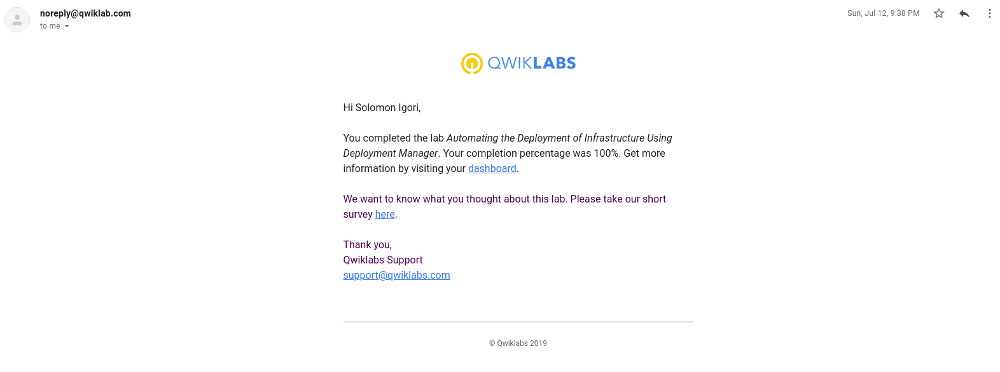

2. [Automating The Deployment Of Infrastructure Using Terraform](./Qwiklabs/AutomatingTheDeploymentOfInfrastructureUsingTerraform.png)
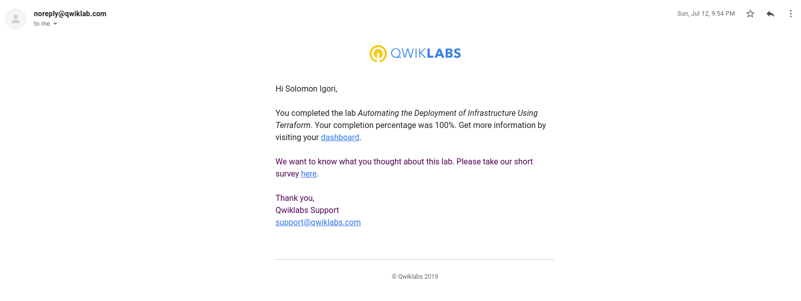

3. [Cloud IAM](./Qwiklabs/CloudIAM.png)
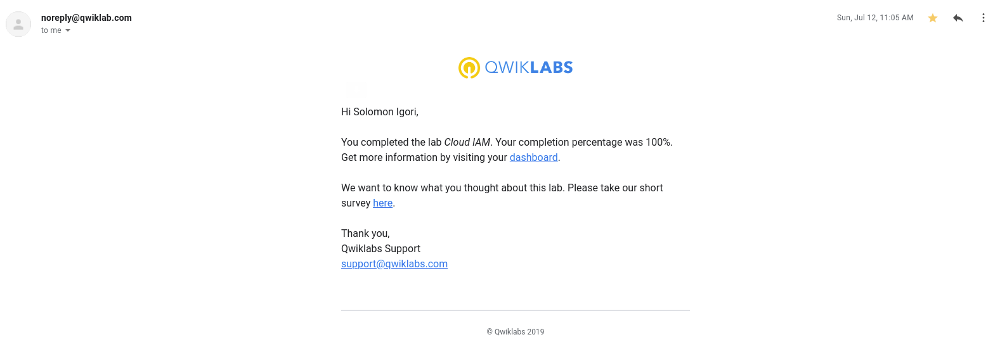

4. [Cloud SQL](./Qwiklabs/cloudSQL.png)
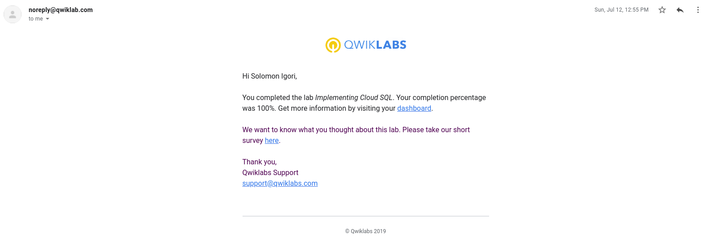

5. [Cloud Storage](./Qwiklabs/CloudStorage.png)
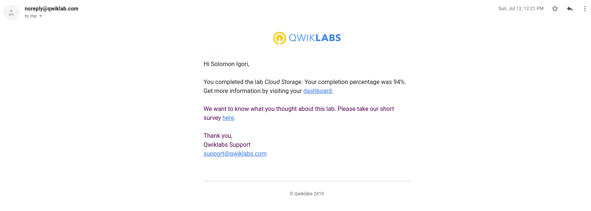

6. [Configuring an HTTP LoadBalancer With Autoscaling](./Qwiklabs/ConfiguringAnHTTPLoadBalancerWithAutoscaling.png)
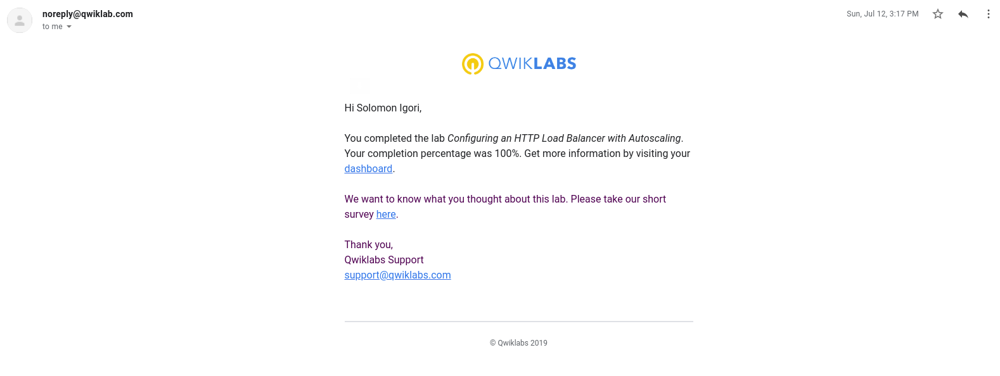

7. [Configuring an Internal LoadBalancer](./Qwiklabs/ConfiguringAnInternalLoadBalancer.png)
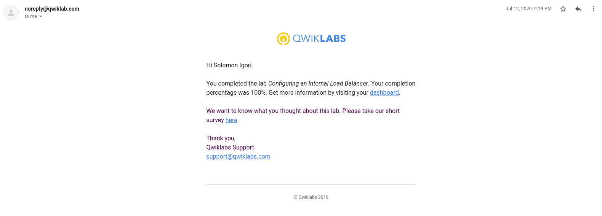

8. [Continuous Deployment with Jenkins v1.6](./Qwiklabs/ContinuousDeploymentWithJenkinsV1.6.png)
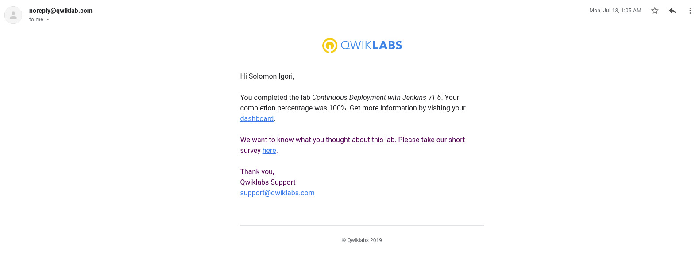

9. [Deploying to Kubernetes v1.6](./Qwiklabs/DeployingToKubernetesV1.6.png)


10. [Error Reporting and Debugging](./Qwiklabs/errorReportingAndDebugging.png)
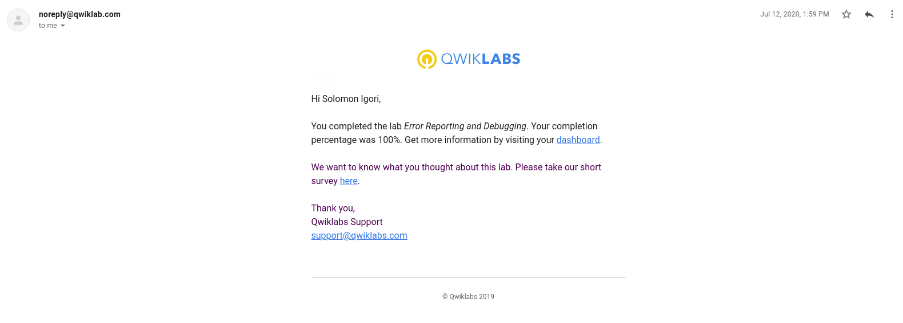

11. [Examining Billing Information with BigQuery](./Qwiklabs/examiningBillingInformationWithBigQuery.png)


12. [Introduction to Containers and Docker v1.6](./Qwiklabs/IntroductionToContainersAndDockerv1.6.png)
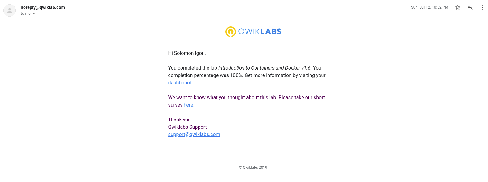

13. [Kubernetes Basics v1.6](./Qwiklabs/KubernetesBasicsV1.6.png)
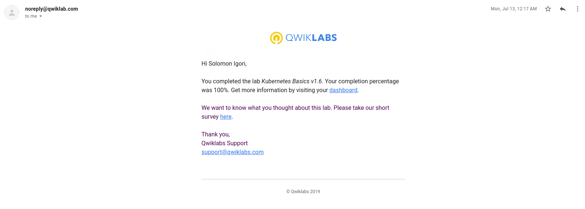

14. [Resource Monitoring](./Qwiklabs/resourceMonitoring.png)
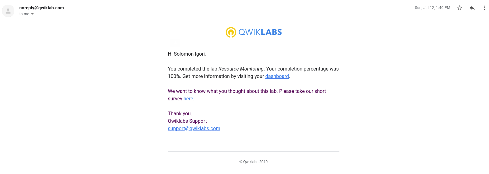

15. [Virtual Private Network](./Qwiklabs/VirtualPrivateNetwork.png)
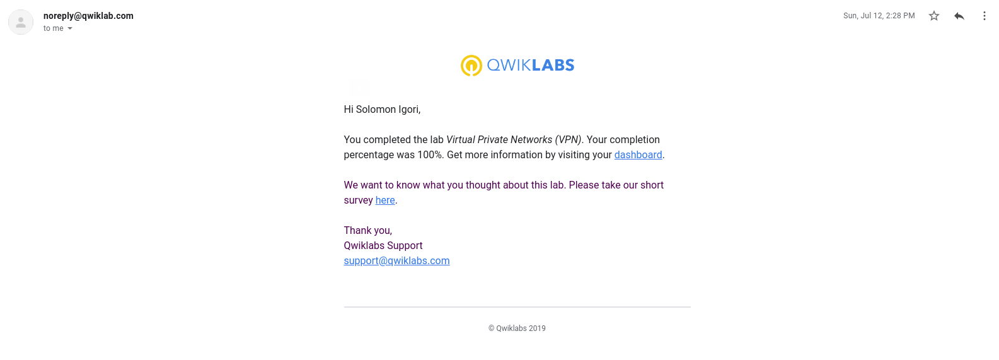
